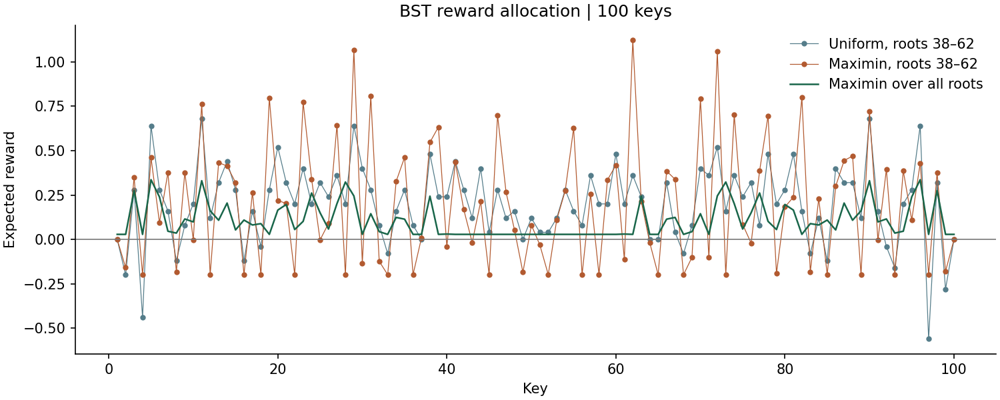

# Binary Search Tree Optimisation

How should a root be chosen if each key's reward depends on its depth in the resulting tree?

This began as an exploratory notebook about weighting root choices and rounding decisions. The current version defines the problem explicitly and uses linear programming to maximise the **lowest expected reward** across keys.

## The model

The keys are 1–100. After choosing the root, each subtree is split at its middle key; where there are two middle keys, the one further from the parent is chosen. Ties go to the upper middle key. A key at depth d receives reward **6 − d**, with the root at depth one.

A mixture assigns a probability to each candidate root. The objective is to maximise the minimum expected reward across all keys:

```text
maximise t
subject to R.T @ w >= t
           sum(w) = 1
           w >= 0
```

Here `R` contains the rewards for each candidate tree. This is a reward-allocation problem, not an improvement to BST lookup complexity. The original notebook called roots “seeds”; they are not random-number seeds.

## Results for 100 keys

| Root-selection policy | Candidate roots | Minimum expected reward | Mean expected reward | Keys below zero |
| --- | --- | ---: | ---: | ---: |
| Uniform mixture | 38–62 | −0.5600 | 0.2000 | 13 |
| Maximin mixture | 38–62 | −0.1982 | 0.2000 | 38 |
| Maximin mixture | 1–100 | **+0.0285** | 0.1057 | **0** |



Allowing all 100 roots produces a mixture with positive expected reward for every key. The full [weight vector](assets/all-root-weights.csv) and [per-key expectations](assets/expanded-key-rewards.csv) are included, so the result can be checked directly.

The trade-off is visible in the table. Improving the worst outcome is different from reducing the number of negative outcomes, and the expanded mixture lowers the overall mean. Positive **expected** reward does not mean every individual tree gives every key a positive reward.

These are numerical results for the stated construction and reward rule. They do not establish a general theorem for all binary search trees.

## Reproduce the calculation

Use Python 3.12:

```bash
git clone https://github.com/Robert-Study/Binary-Search-Tree-Optimisation.git
cd Binary-Search-Tree-Optimisation
python -m venv .venv
```

Activate with `source .venv/bin/activate` on macOS/Linux, or `.venv\Scripts\Activate.ps1` in Windows PowerShell. Then:

```bash
python -m pip install -r requirements.txt
python demo.py
python -m unittest discover -s tests -v
```

Results, weights and the plot are written to `outputs/demo/`. To open the walkthrough:

```bash
python -m pip install -r requirements-notebook.txt
jupyter lab "Binary Search Trees.ipynb"
```

[Saved results](assets/results.json) · [Numerical tests](tests/test_rewards.py) · [GitHub Actions](https://github.com/Robert-Study/Binary-Search-Tree-Optimisation/actions)

The original exploration is retained in Git history. The current implementation reproduces its default tree construction, replaces the incomplete optimisation code, and makes the objective and threshold explicit.
